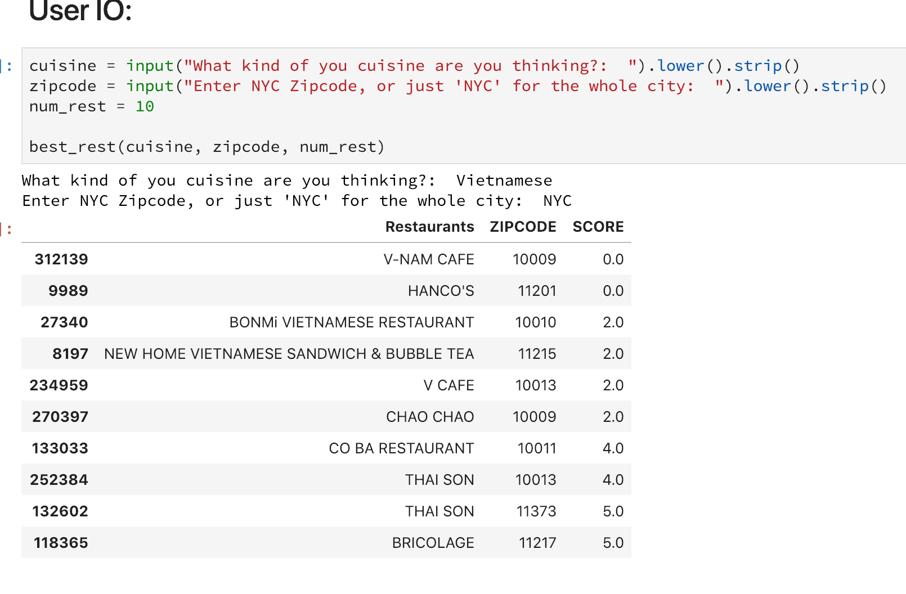

# NYC Restaurant Finder
__Find Best Restaurants for your Favorite Cuisine in your Neighborhood based on Health & Safety Inspection Data:__

NYC Restaurant Finder examines the latest health and safety inspection data for around 26,000 Restaurants serving 78 different cuisines across the New York City and find the best restaurants for your favoute cuisine in your neighborhood that rank highly on Food Safety inspections.

__Author:__ Tarun Gupta
__Company:__ Insight Data Science
__Location:__ Toronto

* _This project was part of the weekend Data Science Challenge at the Insight Data Science in Toronto, ON_*  
__Total Time spent: 4 hours__

 
